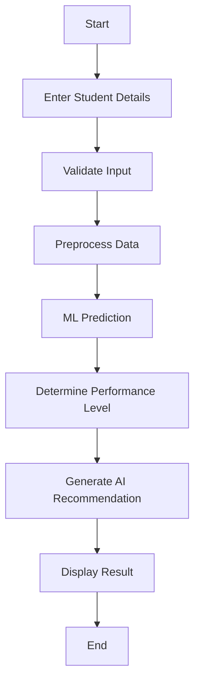
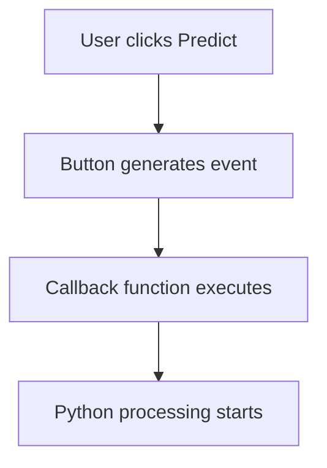
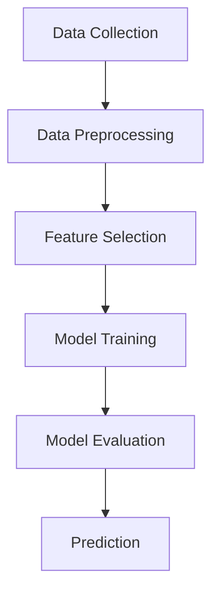

#  Smart Student Performance Prediction System
## 1.Problem Statement:
- Student performance is influenced by multiple academic and behavioral factors.
- Faculty may find it difficult to identify students who are at risk at an early stage.
- A data-driven system can help predict student performance.
- The system can provide recommendations for improving student outcomes.

## 2. Proposed Solution
- Collect student-related information.
- Process the entered data.
- Use a Machine Learning model to predict performance.
- Classify students based on predicted performance.
- Generate intelligent recommendations.
- Display the results through a user-friendly Tkinter interface.

## 3. Flowchart

## 4. Project Mapping

| V-Model Stage | Smart Student Project |
|---|---|
| Requirement Analysis | Identify student performance problem |
| System Design | Design system architecture and UI |
| Implementation | Develop Python + ML application |
| Integration | Integrate UI, ML and AI |
| Testing | Test individual modules and complete system |
| Validation | Check system against requirements |
| Demonstration | Present working capstone |

## 5. Project – Modular Application Development
### Create separate functions:
- get_student_data()
- calculate_average()
- calculate_performance()
- display_result()

## 6. Requirement Analysis
### Identify the User
- Primary users may include:
- Faculty
- Academic coordinators
- Mentors
- Students
## 6.1. Functional Requirements
### The system should:
- Accept student details.
- Validate user inputs.
- Store/process student information.
- Preprocess input data.
- Apply the trained ML model.
- Predict student performance.
- Generate recommendations.
- Display results through the GUI.
- Handle invalid inputs.
- Provide a reset/clear option.

## 6.2. Non-Functional Requirements
### The application should be:
- User-friendly
- Easy to understand
- Fast in generating predictions
- Reliable
- Maintainable
- Scalable
- Secure with respect to student data
-Easy to test

## 7. User Requirement
### The user should be able to:
- Enter student information.
- Submit the information for analysis.
- View predicted performance.
- Understand the student's risk level.
- Receive improvement recommendations.

## 8. Identify System Inputs
### The initial system can use:
- Student ID
- Student name
- Attendance percentage
- Study hours per day
- Internal assessment marks
- Assignment completion percentage
- Previous academic performance
#### Example:
- Parameter	Example
- Attendance	82%
- Study Hours	4 hours/day
- Internal Marks	76%
- Assignment Completion	90%
- Previous Performance	72%

## 9. Identify System Outputs
- Performance Prediction
- Excellent
- Good
- Average
- At Risk

## 10. Additional Output
- Prediction score/probability
- Risk level
- Key factors affecting performance
-Recommended actions
#### Example:

- Prediction: Good Performance
- Risk Level: Low
- Recommendation: Maintain current study pattern and attendance

## 11. Objective

- Understand the System Design phase of the V-Model
- convert Day 1 requirements into a software architecture
- Design the workflow of the Smart Student Performance Prediction System
- Understand GUI development using Tkinter
- Create windows, frames, labels, input fields, buttons, and message boxes
- Apply pack(), grid(), and place() for layout management
- Implement event-driven programming using button callbacks, validate user inputs
- Develop a functional Tkinter prototype.

## 12. From Requirements to System Design

### Input 
- Student ID,
- Student Name
- Attendance percentage
- Study Hours
- Internal Marks
- Assignment Completion percentage
- Previous Academic Performance as inputs
  ### Processing
- validates input
- Preprocesses data
- send data to ML model,
- Generates prediction
-  Generates recommendation
  ### Outputs
-  predicted performance
-  performance category, risk level
-  Recommendation.

## 13. Proposed System Architecture

## 14. UI Design Requirements

The application should contain 
### 1. Student Information Section
- Student ID
- Student Name
### 2.  Academic Information Section
 - Attendance
 - Study Hours
 - Internal Marks
 - Assignment Completion
 - Previous Performance
### 3. Action Section
 - Predict Performance
 - Clear
 - Exit buttons
### 4. Result Section
 - Predicted Performance
 - Risk Level
 - Recommendation.
## 15. Using Frames
### The main window: 
- Header frames
- student information
- Academic information
- Header frame
- Results frame
## 17. Workflow

## 18. Requirements Design

## 19. Objective
- Understand the fundamentals of Machine Learning (ML)
- Differentiate between traditional programming and ML-based systems
- Work with datasets using Pandas & NumPy
- Perform data preprocessing and feature selection
- Train a Machine Learning model for prediction
- Evaluate model performance using basic metrics
- Replace Day 2 rule-based logic with an ML-based prediction system
- Prepare the ML model for integration with Tkinter UI

## 19. OUTCOMES
### Should complete:
- Dataset (CSV file)
- Data preprocessing code
- Trained ML model
- Accuracy report
- Prediction function
- Saved model file (.pkl)
## 20. Traditional Programming vs ML

| Traditional Programming | Machine Learning |
|---|---|
| Rules are written manually | Model learns rules from data |
| Output = Logic + Input | Output = Model + Input |
| Fixed logic | Adaptive learning |
## 21. ML Workflow

## 22. ML WORKFLOW
### Activity 1 – Dataset Creation
Create student dataset in CSV
Add 20–50 records
### Activity 2 – Data Loading
Load dataset using Pandas
Display dataset
### Activity 3 – Data Cleaning
Remove missing values
Check data types
### Activity 4 – Model Training
Train Logistic Regression model
Split dataset
### Activity 5 – Model Evaluation
Calculate accuracy
Analyze results
### Activity 6 – Prediction
Test model with new input
### Activity 7 – Save Model
Save model using Pickle
## 23. Problem Type
### For this Project:
- Classification Problem
### Output categories:
- Excellent
- Good
- Average
- At Risk
### Regression Problem
- Output = Performance Score (0–100)
## 24. Model Selection
### Algorithms Introduced
- Logistic Regression
  
